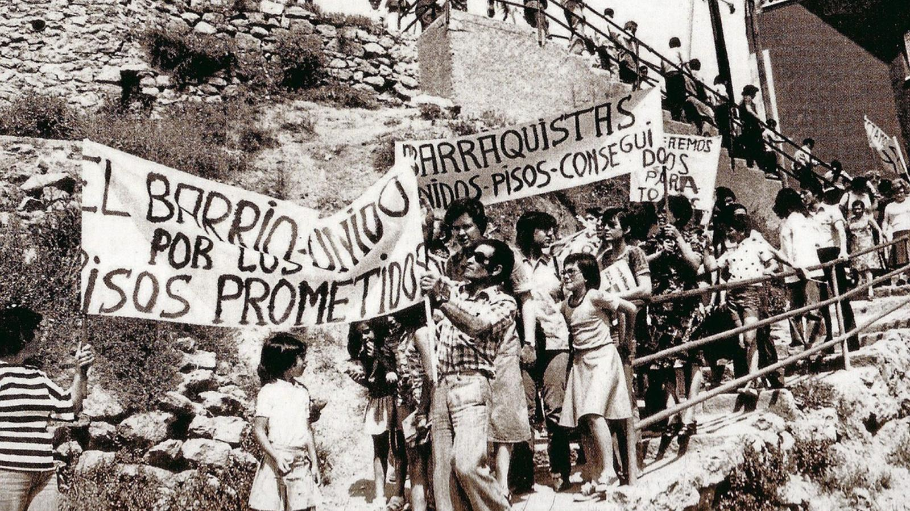

```{r setup, include=FALSE}
options(htmltools.dir.version = FALSE)
knitr::opts_chunk$set(
  fig.width=9, fig.height=3.5, fig.retina=3,
  out.width = "100%",
  cache = FALSE,
  echo = FALSE,
  message = FALSE, 
  warning = FALSE,
  hiline = TRUE
)
```
class: title-slide, inverse, no-action, center, bottom
background-position: bottom
background-size: cover

```{r xaringan-themer, include=FALSE, warning=FALSE}
library(xaringanthemer)
style_duo_accent(
  primary_color = "#D9221A",
  secondary_color = "#F9A39D",
  inverse_header_color = "#FFFFFF"
)
style_mono_accent(
  base_color = "#2a6099",
  header_font_google = google_font("Aboreto"),
  text_font_google   = google_font("Montserrat", "300", "300i"),
  code_font_google   = google_font("Fira Mono")
)
#style_mono_accent(text_color = "#FFFFFF")
```


```{r xaringan-Extra, include=FALSE, echo=FALSE}
# remotes::install_github("gadenbuie/xaringanExtra")
xaringanExtra::use_xaringan_extra(c("tile_view", "animate_css","use_progress_bar"))
```

```{r xaringan-tachyons, echo=FALSE}
xaringanExtra::use_tachyons()
```

```{r xaringanExtra, echo = FALSE}
xaringanExtra::use_progress_bar(color = "#DDDDDD", location = "bottom", height = "10px")
```

# `r toupper(rmarkdown::metadata$title)`
----
### `r rmarkdown::metadata$subtitle`
<br>
<div>

</div>
### `r toupper(rmarkdown::metadata$author)`
#### `r rmarkdown::metadata$date`


---
name: WHOIAM
class: inverse, left, center, hide-logo


# `r fontawesome::fa("quote-left", a11y = "sem", fill = "#FFFFFF")` Eloi Mayordomo `r fontawesome::fa("quote-right", a11y = "sem", fill = "#FFFFFF")`
#### Editor [`r fontawesome::fa("laptop", a11y = "sem", fill = "#FFFFFF")` .white[`r rmarkdown::metadata$institute`]](lleiengel.cat)
----
<style>
.pq{font-size: .5em;}
</style>

.pull-left[
<p style="text-align: left;">
<big><u>FORMACIÓ</big></u>  <br>
- Llicenciat en Ciències Polítiques i de l'Administració. (UPF).<br><br> 
- Màster en polítiques locals i participació (UAB).<br><br>
- Analista de dades per a la gestió pública (UB).<br><br>
</p>
]

.pull-right[
<p style="text-align: left;">
<big><u>EXPERIÈNCIA</big></u></b>
- Consultor àmbit privat en polítiques públiques participatives (2005 - 2010) <br><br>
- Tècnic de Serveis Socials d'Infància en situació de risc social - Diputació de Barcelona (2011-2021) <br><br>
- Tècnic de la Unitat de Cicle de Vida del Servei de Convivència, Diversitat i Cicle de Vida - DIBA. </a></u></b><br>
</p>  
]

 
[`r fontawesome::fa("envelope", a11y = "sem", fill = "#FFFFFF")` ](mailto:eloimm@yahoo.com)<b>·</b> 
[`r fontawesome::fa("laptop", a11y = "sem", fill = "#FFFFFF")` ](https://eloimm.github.io/)<b>·</b> 
[`r fontawesome::fa("twitter", a11y = "sem", fill = "#FFFFFF")` ](https://twitter.com/eloimm) <b>·</b>
[`r fontawesome::fa("mastodon", a11y = "sem", fill = "#FFFFFF")` ](mastodont.cat/@eloimm)  
[`r fontawesome::fa("house", a11y = "sem", fill = "#FFFFFF")` .white[bit.ly/IGOP_UAB]](https://eloimm.github.io/IGOP)

---
name: territorial
class: title-slide, no-action
background-position: 100% 50%
background-size: 100% 100%
background-image: url("images/territorial.jpg")
class: top
# La localització territorial de les desigualtats .pq[El(s) barri(s)]


---
name: barraquisme
class: inverse,
# La localització
----
<html>
  <head>
    <meta charset="UTF-8">
    <title>Galeria d'imatges</title>
    <style>
      section {
        display: flex;
        width: 100%;
        height: 430px;
        overflow-x: scroll;
      }

      section img {
        width: 0px;
        flex-grow: 1;
        object-fit: cover;
        opacity: .8;
        transition: 5 sec ease;
      }

      section img:hover{
        cursor: crosshair;
        width: 300px;
        opacity: 1;
        filter: contrast(120%);
      }
    </style>
  </head>
  <body>
    <section>
      
      
      
      
      
    </section>
  </body>
</html>

---
name: barraquisme
class: inverse,
# L'abordatge 
----
<html>
  <head>
    <meta charset="UTF-8">
    <title>Galeria d'imatges</title>
    <style>
      section {
        display: flex;
        width: 100%;
        height: 430px;
        overflow-x: scroll;
      }

      section img {
        width: 0px;
        flex-grow: 1;
        object-fit: cover;
        opacity: .8;
        transition: 5 sec ease;
      }

      section img:hover{
        cursor: crosshair;
        width: 300px;
        opacity: 1;
        filter: contrast(120%);
      }
    </style>
  </head>
  <body>
    <section>
      
      
      
      
    </section>
  </body>
</html>

---
name: barraquisme
class: inverse,
# L'oposició 
----
<html>
  <head>
    <meta charset="UTF-8">
    <title>Galeria d'imatges</title>
    <style>
      section {
        display: flex;
        width: 100%;
        height: 430px;
        overflow-x: scroll;
      }

      section img {
        width: 0px;
        flex-grow: 1;
        object-fit: cover;
        opacity: .8;
        transition: 5 sec ease;
      }

      section img:hover{
        cursor: crosshair;
        width: 300px;
        opacity: 1;
        filter: contrast(120%);
      }
    </style>
  </head>
  <body>
    <section>
      
      
      
      
    </section>
  </body>
</html>
---
name: ciutat
class: title-slide, no-action
background-position: 100% 50%
background-size: 100% 100%
background-image: url("images/disputa.png")
name: sistema
class: top
# La ciutat és un procés en disputa 

---
name: provisió
class: top, animated bounceInDown
# La provisió del benestar 
<p align="center">

</p>
---
name: familia
class: top
# La família 
.pull-left[
<p align="center">

</p>
]

.pull-right[
- La .white.bg-blue[familia] és un **fenomen social total**, és a la vegada, un fet jurídic, econòmic, religiós, i fins i tot, estètic.   
  - Institució primària.
  - Capital social, cultural, econòmic heredat.  
  - Institució protectora: 
      - de provisió de cures (reproductiu però també de productiu infrapagat)  
      - on es practiquen economies d'escala  
  
- La **FAMÍLIA** és un constructe ideològic (variació segons les necessitats de la societat d'intercanvi)  
- La **modernitat** planteja com a programa polític, **l'alliberament individual** respecte la família i la comunitat; però alhora, posa de relleu la necessitat de relacions solidàries, primàries o orientades a l'emancipació.
]
---
# El mercat 
.pull-left[
<p align="center">

</p>
]
.pull-right[
Dificultats del .white.bg-blue[mercat laboral] per a traslladar els períodes de creixement econòmic al conjunt de la població.  
- Mercat laboral dualitzat   
  
- Impacte diferenciat dels ingressos salarials
  - Gènere: bretxa salarial, 
  - Joves: accés i participació sostinguda, i 
  - Dels immigrants i racialitzats, branques d'ocupació 
  - Persones de capacitat diverses
    entre d'altres.  
- Treballadors _pobres_  

**El mercat és un pèssim assignador de drets**  

**Mercantilització de béns i serveis** (mercantilització secundària)  

**Importància del sector financer**: l'habitatge és una **reserva de valor**  
]
---
name: estat
background-position: 150% 150%
class: top
# Els poders públics 
.pull-left[
<p align="center">

</p>
--
.white.bg-blue[Polítiques de cobertura de necessitats] i reducció de la pobresa (IMV, RGC, prestacions locals,...)
]
.pull-right[
.white.bg-blue[Paradigma de la «INVERSIÓ SOCIAL»] o «inversió en capital humà» (especialment 1rs anys)

**IMPLICACIONS:**  
- **«Igualtat d’oportunitats»** + **«l’activació»** 

- **Individualització**: incidir sobre les conductes, les motivacions i les actituds dels individus.  

- **Treball com a mecanisme per a la participació i l’autonomia social i econòmica**  

- **Principi de contractualització**: del contracte social ➡ compromís individual/moral.    

La **política social és un factor productiu més**? Meritocràcia?
]
---
name: perque
background-position: 150% 150%
class: inverse, middle, center, animated bounceInDown
# La intervenció comunitària:<br> per a què?
<p align="center">

</p>
# Des d'on? 
---
class: title-slide, no-action
background-position: 30% 30%
background-size: 150% 150%
background-image: url("images/desigualtat.jpg")
background-size: cover
## .right[**Algunes hipòtesis**]
.pull-right[
*	**Lluita contra les desigualtats**  

*	**Combat contra la pobresa**  

*	**Promoure la mobilitat social** 

*	**Afavorir la “inclusió” social (interacció)**
]
.pull-left[

]
---
class: top
# Per a què? .pq[Alguns límits]
----
-  Els motors de desigualtat i la capacitat d'incidència. .black.bg-yellow[Pertinença _de l'escala_.]   
  
  
--
  
* Límits a la intervenció pública:  

    - La **_paradoxa de la redistribució_** ([Korpi, W., & Palme, J. (1998)](https://doi.org/10.2307/2657333)); i 
    
    - La **_paradoxa de la inversió social_** ([Cantillon, B. (2011)](https://doi.org/10.1177/0958928711418856))  
    
--
  
- _Governança complexa_ ([Mayordomo Martínez, E (2021)](http://lagestioimporta.cat/arees/la-infancia-o-la-governanca-complexa/)):

  - Un disseny institucional multinivell  
  
  - Abordatge sectorial per part dels poders públics  
  
  - Accés i participació _estable_ als serveis públics 

--
  
- Diversitat d'interessos i poders dels actors  
  
--
  
- Punts de partida diversos: capital social, cultural, econòmic (reproducció social).  
  
--
  
- Les habilitats adquirides i experiències viscudes

--
- **.white.bg-blue[_Wicked problems_] i .white.bg-blue[complexitat de les intervencions restauratives]**  

---
name: serveis socials
class: title-slide, no-action
background-position: 100% 50%
background-size: 100% 100%
background-image: url("images/igualtat.jpg")
name: sistema
class: top
# La intervenció comunitaria, <br>des d'on?

.pull-left[

> Les comunitats constitueixen espais relacionals bàsics de solidaritat, reciprocitat, atenció a les cures i participació ciutadana que discorren entre la vida quotidiana 

(Fantova, 2021)  

]
.pull-right[
> Una funció primordial de l’activitat professional dels serveis socials haurà de ser l’acompanyament en la vertebració de comunitats allí on no n’hi ha o són molt dèbils a causa de la concentració de necessitats socials i els processos de desagregació col·lectiva   

.right[([Godàs, 2012](https://lleiengel.cat/comunitat-i-accio-social-professional/))]
]

---
class: top
# Des d'on? .pq[Els sistemes]
<p align="center">

</p>

.center[[Aguilar Hendrickson, M. (2021)](https://www.serviciossocialescantabria.org/uploads/documentos/Responsabilidades)]
---
name: final
class: title-slide, animated bounceInDown
background-position: 100% 100%
background-size: 100% 100%
background-image: url("images/sociograma.png")
background-size: cover
class: top
# Reflexions finals

---
name:reflexions
class: top
### Reflexions finals, respecte...
----

.pull-left[
# .pq[Objectius]
- Els individus com a agència (pressupòsits?)   

- El treball comunitari, genera interacció, suport instrumental, vincle social o vincle emocional?   

- Amb qui es genera, amb els iguals, els diferents, els altres ( _bounding_)?  

- És viable transformar des dels vincles?    

- Quins processos de reciprocitat, atenció a les cures i participació ciutadana promovem? (Per a qui)   

- L'abordatge de les desiguatats genera _tancament_ i ratificació aquesta situació (interseccionalitat)  

- Les edats impliquen varietats de suports
]  

--
  
.pull-right[
# .pq[Metodologia]
- Importància de formalitzar les hipòtesis de treball  

- Fonamentar les actuacions amb evidències  

- Avaluar els resultats (i impactes?) de les intervencions
  
- Rol professional honest  

]  
---
name: debat
class: middle, inverse, center, animated bounceInDown
# ...Més intercanvi de visions!
----
---
name: Thks
class: inverse, middle, center, hide-logo
# Moltes gràcies!
----
### Per a qualsevol suggeriment:
  
<br>
<b>·</b> 
[`r fontawesome::fa("envelope", a11y = "sem", fill = "#FFFFFF")` ](mailto:eloimm@yahoo.com)<b>·</b> 
[`r fontawesome::fa("laptop", a11y = "sem", fill = "#FFFFFF")` ](https://eloimm.github.io/)<b>·</b> 
[`r fontawesome::fa("twitter", a11y = "sem", fill = "#FFFFFF")` ](https://twitter.com/eloimm) <b>·</b>
[`r fontawesome::fa("mastodon", a11y = "sem", fill = "#FFFFFF")` ](mastodont.cat/@eloimm)<b>·</b> 

<br>
.center[[`r fontawesome::fa("laptop", a11y = "sem", fill = "#FFFFFF")` .white[bit.ly/IGOP_UAB]](https://eloimm.github.io/IGOP)]
---
name: biblio
class: inverse, middle, center, hide-logo
# BIBLIOGRAFIA

---
# Bibliografia 

- Aguilar Hendrickson, Manuel (2021). Ponencia ["Responsabilidades e integración vertical de los servicios sociales".]([https://www.serviciossocialescantabria.org/uploads/documentos/Responsabilidades) Aula Permanente de Servicios Sociales. Santander.  

- Assemblea de ressistències al Fòrum 2004, Espai en blanc, Col·lectiu Ariadna Pi de l'Institut Català d'Antropologia (2004) [La otra cara del Fòrum de les cultures S.A. Bellaterra](https://sindominio.net/mapas/textos/la_otra_cara.pdf)

- Cantillon, B. (2011). [The paradox of the social investment state: growth, employment and poverty in the Lisbon era](https://doi.org/10.1177/0958928711418856). Journal of European Social Policy, 21(5), 432-449. https://doi.org/10.1177/0958928711418856 

- Fantova, Fernando (2021), “Construir fraternidad: los cuidados y la agenda comunitària del benestar”, a Gomà, Ricard i Ubasart, Gemma (Coords.) (2021), Vidas en transición. (Re)construir la ciutadania social, Madrid: Tecnos, pp. 295-313.

- Godàs,  Xavier (2021), ["Concepte de comunitat i acció social professional". Llei Engel]((https://lleiengel.cat/comunitat-i-accio-social-professional/)   

- Korpi, Walter &  Palme, Joakim (1998) [The Paradox of Redistribution and Strategies of Equality: Welfare State Institutions, Inequality, and Poverty in the Western Countries](https://www.jstor.org/stable/2657333) American Sociological Review, 63(5), 661-687. https://doi.org/10.2307/2657333

- Tatjer, Mercè & Larrea, Cristina (ed) (2010) Barraques. [La Barcelona informal del segle XX.Museu d'Història de Barcelona](https://www.barcelona.cat/museuhistoria/sites/default/files/barraques.pdf)

- Unió Temporal d'Escribes (UTE) (2004) [Barcelona, marca registrada. Un model per desarmar. Virus Ed.](https://www.viruseditorial.net/paginas/pdf.php?pdf=barcelona-marca-registrada.pdf)
